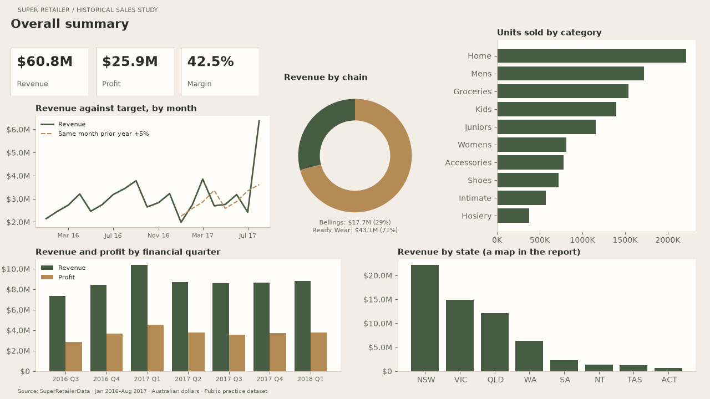
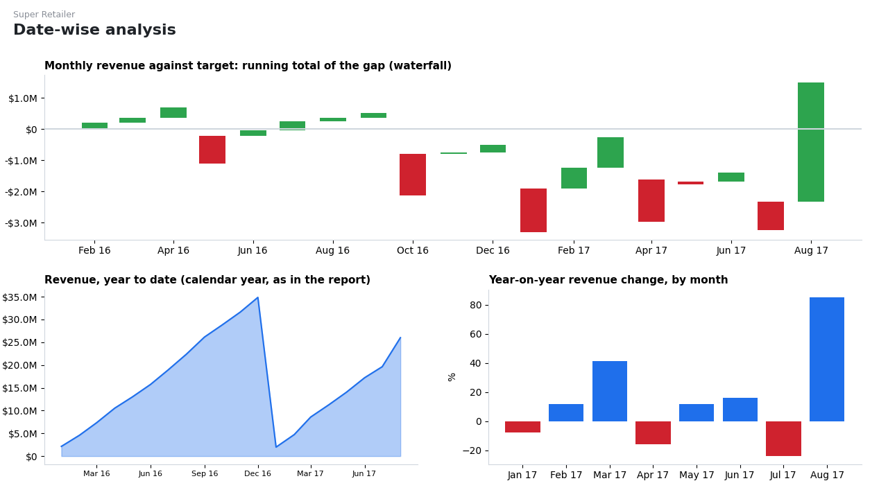
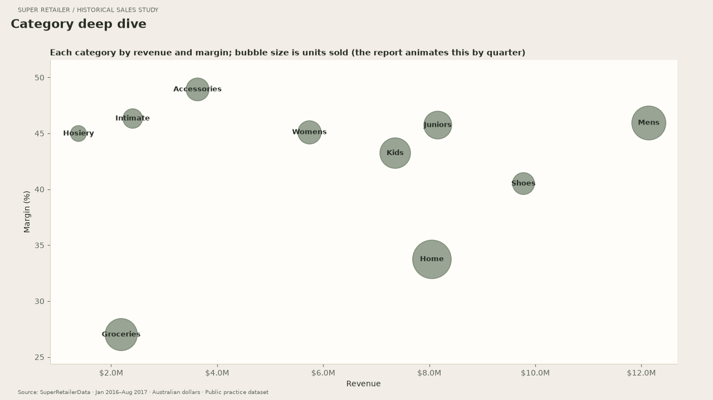
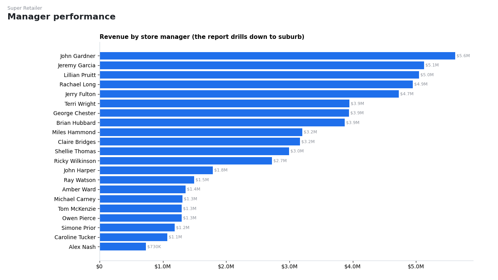
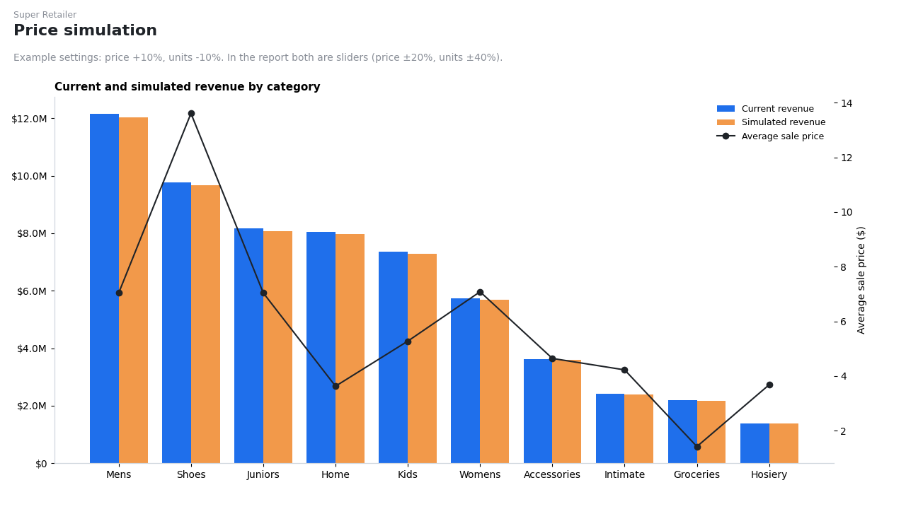

# Super Retailer: Power BI Sales Report

A five-page Power BI report on the sales of two Australian clothing chains, **Ready Wear** and **Bellings**, from January 2016 to August 2017. It covers revenue, profit and margin by time, category, state and store manager, plus a what-if simulator for price and volume changes. It is built on a public practice dataset, **SuperRetailerData**.

The report is [`Super Retailer Report.pbix`](Super%20Retailer%20Report.pbix). Opening it needs [Power BI Desktop](https://powerbi.microsoft.com/desktop/), which runs on Windows. On a Mac, upload it to the Power BI web service, or use a Windows virtual machine.

**To see the report without Power BI:** the five pages are below, and all of them are in [`Super Retailer Report.pdf`](Super%20Retailer%20Report.pdf). These views were redrawn with Python from the data stored inside the `.pbix` file, with a revised visual style and explicit calculation improvements. The PDF and PNG pages include July–June financial-year YTD, a prior-year-month +5% target, manager revenue alongside margin, and elasticity scenarios for revenue and profit. The PBIX now uses the matching ivory/sage palette, softer borders and no card shadows across its five pages. Its embedded data model and calculations remain unchanged; the calculation improvements described above currently apply to the Python exports.

### Overall summary


### Date-wise analysis


### Category deep dive


### Manager performance


### Price simulation


## Revised report export

The five PDF/PNG pages use an ivory, sage and warm-brown theme with consistent labels and source footers. The editable PBIX also includes this palette and quieter visual containers. [`retail-theme.json`](retail-theme.json) is available for reuse in Power BI Desktop. The PBIX archive and all five layout pages were checked, and its embedded model was verified byte-for-byte unchanged. Opening/rendering the modified PBIX still needs verification in Power BI Desktop on Windows.

- Financial-year YTD resets in July. The first financial year is partial because data starts in January 2016.
- Revenue targets use the same month one year earlier plus 5%; no target is invented when the prior-year month is unavailable.
- Manager revenue is shown beside margin, sorted by margin. Product mix and territory size still prevent causal performance claims.
- Price scenarios show both revenue and profit under elasticity 0, −1 and −1.5. These are assumptions, not estimated demand responses.

Reproduce the export:

```bash
pip install pbixray pandas matplotlib
python scripts/render_pages.py
```

The assertions check July YTD resets and constant revenue under elasticity −1. The DAX below remains guidance for implementing equivalent changes in Power BI Desktop.

## Key figures

All figures below were recalculated from the data inside the report.

| | |
| --- | --- |
| Revenue, Jan 2016 – Aug 2017 | **$60.8M** |
| Profit | **$25.9M** (42.5% margin) |
| Only complete financial year (Jul 2016 – Jun 2017) | $36.3M revenue, $15.6M profit |
| Growth, Jan–Aug 2017 vs Jan–Aug 2016 | **+16.3%** revenue |

- **Ready Wear is the bigger chain:** 71% of revenue, though at a slightly lower margin than Bellings (41.9% vs 43.9%).
- **Menswear leads**, with 20% of revenue. Groceries (27%) and Home (34%) earn the thinnest margins, well below every clothing category (40–49%).
- **New South Wales brings in 37% of revenue**, Victoria 24% and Queensland 20%.

## Report pages

| Page | What it shows |
| --- | --- |
| **Overall summary** | Revenue, profit and margin cards; revenue against target over time; revenue and profit by financial quarter; revenue by chain; units by category; a map of revenue by state; slicers for financial year and state |
| **Date-wise analysis** | Revenue gap vs prior-year-month +5%; financial-year YTD; year-on-year change by month |
| **Category deep dive** | Every category plotted by revenue against margin, sized by units, with a play axis that steps through the quarters |
| **Manager performance** | Revenue and margin for 21 managers, sorted by margin in the export; the PBIX drills down to suburb |
| **Price simulation** | Export: revenue and profit curves under three elasticity assumptions. Original PBIX: independent price and volume sliders |

## Data model

The data comes from one Excel workbook with five sheets, loaded with Power Query. There are about 81,000 monthly sales rows, each with a chain, postcode, category, units, sale price and cost price.

```
Sales (fact) ──Postcode──> Regions   (state, suburb)
             ──Postcode──> Managers  (store manager)
             ──Category──> Buyers    (category buyer)
             ──Date──────> Dates     (month, Australian financial year Jul–Jun, FY quarter)
```

**Calculated columns** on `Sales`:
- `Revenue = Sale Price × Total Units`
- `Profit = (Sale Price − Cost Price) × Total Units`

**Measures:**

```dax
Revenue Measure    = SUMX(Sales, Sales[Total Units] * Sales[Sale Price])
Profit Measure     = SUMX(Sales, (Sales[Sale Price] - Sales[Cost Price]) * Sales[Total Units])
Margin %           = SUM(Sales[Profit]) / SUM(Sales[Revenue])
Avg Sale Price     = SUM(Sales[Revenue]) / SUM(Sales[Total Units])
Target Revenue     = CALCULATE([Revenue Measure], PREVIOUSMONTH(Dates[Date])) * 1.05
Revenue variance   = IF(ISBLANK([Target Revenue]), BLANK(), [Revenue Measure] - [Target Revenue])
Revenue YTD        = TOTALYTD([Revenue Measure], Dates[Date])
Revenue LY         = CALCULATE([Revenue Measure], SAMEPERIODLASTYEAR(Dates[Date]))
YoY revenue change = IF(ISBLANK([Revenue LY]), BLANK(), [Revenue Measure] / [Revenue LY] - 1)
Simulated revenue  = SUMX(Sales, Sales[Sale Price] * (1 + [Price Change % Value])
                               * Sales[Total Units] * (1 + [Units Change % Value]))
```

The simulator's sliders are what-if parameter tables made with `GENERATESERIES`: −20% to +20% in 1% steps for price, and −40% to +40% in 2% steps for units.

## Original PBIX issues and Power BI fixes

These are problems in the report as it stands, with the DAX to fix each one.

**1. Year-to-date resets in January, but the financial year starts in July.** `TOTALYTD` defaults to a calendar year, while the report's slicers and quarters use the Australian July–June financial year. So in August 2016 the report shows $22.4M year to date; the correct financial-year figure is $6.6M. The fix is to give the year-end date:

```dax
Revenue YTD = TOTALYTD([Revenue Measure], Dates[Date], "6/30")
```

**2. The price simulator can't show the trade-off it exists for.**
- Price and volume are separate sliders, and the volume response has to be guessed and set by hand. Nothing ties a price rise to lost sales.
- It shows revenue only. Costs don't change with price, so profit is what moves most.

A version that adds an elasticity parameter (how much volume falls for each 1% price rise) and reports profit:

```dax
Elasticity         = SELECTCOLUMNS(GENERATESERIES(-3, 0, 0.1), "Elasticity", [Value])   -- parameter table
Elasticity Value   = SELECTEDVALUE(Elasticity[Elasticity], -1)
Simulated units    = SUMX(Sales, Sales[Total Units] * POWER(1 + [Price Change % Value], [Elasticity Value]))
Simulated revenue  = SUMX(Sales, Sales[Sale Price] * (1 + [Price Change % Value])
                               * Sales[Total Units] * POWER(1 + [Price Change % Value], [Elasticity Value]))
Simulated profit   = SUMX(Sales, (Sales[Sale Price] * (1 + [Price Change % Value]) - Sales[Cost Price])
                               * Sales[Total Units] * POWER(1 + [Price Change % Value], [Elasticity Value]))
```

Worked on this data, a price rise helps profit far more than revenue, and how much depends on how customers respond:

| Price change | Customers' response (elasticity) | Revenue | Profit |
| --- | --- | ---: | ---: |
| +5% | none (0) | +5.0% | +11.8% |
| +5% | proportional (−1) | 0.0% | +6.4% |
| +5% | strong (−1.5) | −2.4% | +3.9% |
| +10% | none (0) | +10.0% | +23.5% |
| +10% | proportional (−1) | 0.0% | +12.3% |
| +10% | strong (−1.5) | −4.7% | +7.1% |

**3. The revenue target is arbitrary.** `Target Revenue` is last month's revenue plus 5%. Retail sales are seasonal, so for December or January that target says more about the calendar than about performance. Using the same month last year plus a growth rate is fairer, with the rate as a what-if parameter:

```dax
Target growth       = SELECTCOLUMNS(GENERATESERIES(0, 0.2, 0.01), "Target growth", [Value])   -- parameter table
Target Revenue      = [Revenue LY] * (1 + SELECTEDVALUE('Target growth'[Target growth], 0.05))
```

**4. Manager performance measures territory size, not performance.** Managers are ranked by total revenue, so a manager with more or bigger postcodes ranks higher regardless of how well the stores do. Revenue ranges from $5.6M to $0.7M across the 21 managers. Ranking on year-on-year growth or margin would compare them more fairly.

## Data source

The queries read `SuperRetailerData` from a local Excel file. To refresh the report with your own copy, go to *Transform data → Data source settings → Change source* in Power BI Desktop.
